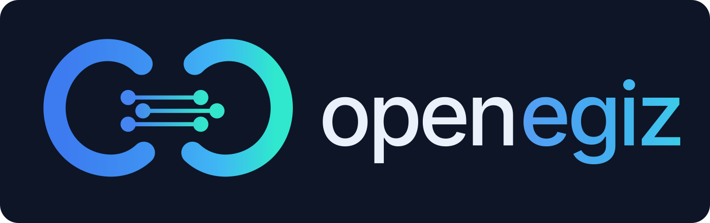

# OpenEgiz

<p align="center">
  
</p>

*English version: [OPENEGIZ.md](OPENEGIZ.md)*

Открытая платформа цифровых двойников для промышленности: живое состояние двойников (Eclipse Ditto), телеметрия (MQTT → Telegraf → InfluxDB), дашборды и интерфейс управления двойниками (Grafana), 3D-визуализация (Unity WebGL).

Два способа развёртывания, оба полноценные:

- **Docker Compose** — одна команда на ноутбуке, в CI или на машине судьи конкурса. Начинайте с него.
- **Helm на k3s** — серверный путь, на нём работает наш ARM64-стенд в лаборатории.

Основано на [OpenTwins](https://github.com/ertis-research/opentwins) (ERTIS Research, Университет Малаги). Этот форк добавляет развёртывание через Compose со сквозным smoke-тестом, поддержку ARM64, вендоренные Grafana-плагины (без зависимости от чужих релизов в рантайме), исправления стабильности и [Пример рудника](examples/mine/README.ru.md).

**Если OpenEgiz вам пригодился, поставьте репозиторию ⭐ звезду** — так проект находят другие люди и компании.

## Быстрый старт (Docker Compose)

**Что нужно:** Docker с Compose v2.20+ (Docker Desktop на macOS/Windows, Docker Engine на Linux), `git`, `make` и **6 ГБ памяти для Docker** (сам стенд занимает около 3,2 ГБ). Работает на amd64 и arm64. В Ubuntu/Debian `make` по умолчанию не установлен: `sudo apt install make`. На Windows всё выполняется внутри WSL2 — сначала [подготовьте Windows](#windows-wsl2).

```bash
git clone https://github.com/aleka07/openegiz.git
cd openegiz
make up
```

Первый запуск генерирует пароли, скачивает около 2,3 ГБ образов и собирает один образ из исходников — это займёт несколько минут; следующие запуски укладываются в минуту. В конце команда печатает адреса и логины:

```text
  Grafana        http://localhost:3000        admin / <сгенерированный>
  Ditto API      http://localhost:8080/api/2  ditto / <сгенерированный>
  ...
```

Затем поставьте сверху маленький цифровой рудник и проверьте, что всё работает от начала до конца:

```bash
make example-mine   # двойники, симулятор рейсов самосвалов и дашборд в Grafana
make smoke          # сквозная проверка: MQTT -> Ditto -> Telegraf -> InfluxDB -> Grafana
```

Откройте Grafana → **Dashboards → OpenEgiz Examples → Example Mine**. Сами двойники — в приложении **OpenEgiz** → **Twins**. Что внутри примера и как в нём текут данные: [examples/mine/](examples/mine/README.ru.md).

| Команда | Что делает |
|---|---|
| `make up` | Запустить платформу (при первом запуске — сгенерировать пароли в `deploy/compose/.env`) |
| `make example-mine` | Запустить платформу и Пример рудника; после этого `make up` / `make down` поднимают и останавливают рудник вместе с платформой |
| `make example-mine-stop` | Остановить симулятор рудника; двойники и данные остаются |
| `make smoke` | Сквозная проверка работающего стенда |
| `make ps` / `make logs S=<сервис>` | Статус сервисов / логи |
| `make generate-data` | Демо с печами: два двойника печей с имитацией телеметрии ([examples/oven/](examples/oven/)) |
| `make down` | Остановить, данные сохранить |
| `make clean` | Остановить и **удалить все данные и пароли** |

Пароли генерируются один раз на каждую копию репозитория и лежат в `deploy/compose/.env` (в git не попадает). Паролей по умолчанию нет. Порты слушают только `127.0.0.1`.

### Windows (WSL2)

OpenEgiz работает внутри Linux-дистрибутива под WSL2, а не в PowerShell. Проверено на Windows 11 24H2 с Docker Desktop 28 и WSL 2.4.

1. Установите [Docker Desktop](https://docs.docker.com/desktop/setup/install/windows-install/) с бэкендом WSL 2 и запустите его.
2. В PowerShell установите Ubuntu 24.04 и сделайте её дистрибутивом WSL по умолчанию:

   ```powershell
   wsl --update
   wsl --install -d Ubuntu-24.04
   wsl --set-default Ubuntu-24.04
   ```

   Пишите именно `Ubuntu-24.04`: просто `Ubuntu` сейчас ставит 26.04, и в нашем тесте она не запустилась на WSL 2.4. При первом запуске Ubuntu попросит создать пользователя Linux.

   `--set-default` важен: Docker Desktop подключается к дистрибутиву WSL *по умолчанию*, а сразу после установки это его собственный служебный `docker-desktop`. Вместо этого можно включить Ubuntu-24.04 в Docker Desktop → Settings → Resources → WSL integration.
3. Откройте **Ubuntu 24.04** из меню «Пуск», проверьте, что работает `docker version`, и установите `make`:

   ```bash
   sudo apt update && sudo apt install -y make
   ```

4. Дальше — быстрый старт выше, в этом терминале Ubuntu. Клонируйте в домашнюю папку Linux (сначала `cd ~`), а не в `/mnt/c`: файлы на стороне Windows из WSL читаются намного медленнее.

### Если что-то не так

| Симптом | Что делать |
|---|---|
| `Docker is not running` | Запустить Docker Desktop, на Linux — `sudo systemctl start docker` |
| `make: command not found` | `sudo apt install make` (Ubuntu/Debian) |
| Windows: `docker: command not found` внутри Ubuntu | Docker Desktop не подключён к этому дистрибутиву: `wsl --set-default Ubuntu-24.04` в PowerShell или Docker Desktop → Settings → Resources → WSL integration. См. [Windows (WSL2)](#windows-wsl2) |
| `Ports already in use: MQTT_PORT=1883` (или другой) | Порт занят чем-то ещё (часто локальным Mosquitto). Остановите его или поменяйте порт в `deploy/compose/.env` и снова выполните `make up` |
| Предупреждение `Docker has N GiB of memory`, контейнеры перезапускаются | Дайте Docker 6 ГБ: Docker Desktop → Settings → Resources |
| `Docker Compose ... is too old` | Обновите Docker; старый `docker-compose` v1 не поддерживается |
| `make up` падает на init job | `make logs S=init`; обычно Ditto ещё не успел подняться — выполните `make up` ещё раз |
| Что-то другое | `make ps`, затем `make logs S=<сервис>`; `make clean && make up` — начать с чистого листа |

## Свои двойники

Двойник — это [thing в Ditto](https://eclipse.dev/ditto/basic-thing.html). Создать его можно в Grafana (приложение **OpenEgiz** → **Twins** → **New twin**, политика `default:basic_policy`) или одним HTTP-запросом — и формат, и сам запрос показаны в [examples/mine/twins.json](examples/mine/twins.json) и [setup_twins.py](examples/mine/setup_twins.py).

Телеметрию шлите сообщениями [Ditto protocol](https://eclipse.dev/ditto/protocol-overview.html) в любой MQTT-топик под `telemetry/` (по соглашению `telemetry/<имя-двойника>`), MQTT анонимный, `localhost:1883`:

```json
{
  "topic": "org.openegiz.mine/truck-01/things/twin/commands/modify",
  "path": "/features",
  "value": {
    "payload": { "properties": { "value": 92.5, "unit": "t" } },
    "speed":   { "properties": { "value": 31.0, "unit": "km/h" } }
  }
}
```

Используйте именно такую форму — `modify` по пути `/features` со всеми признаками двойника. Она заменяет все признаки целиком, поэтому отправляйте их все каждый раз. Более узкий путь (например, `/features/payload/properties/value`) Ditto тоже примет, но Telegraf сохранит число в поле с именем просто `value`, без названия признака, и дашборды не смогут отличить один признак от другого.

Ditto обновляет двойник и публикует изменение дальше; Telegraf пишет его в InfluxDB (bucket `default`, measurement `mqtt_consumer`, поле `value_<признак>_properties_value`, тег `thingId`); Grafana читает оттуда. Telegraf сбрасывает данные раз в 10 с — новые точки появляются с такой задержкой. Готовый компактный пример отправителя — [examples/mine/simulator.py](examples/mine/simulator.py).

## 3D: контракт с Unity WebGL

3D необязательно. Вендоренная панель Grafana **Unity** запускает WebGL-сборку Unity прямо в дашборде, передаёт ей данные двойников и умеет получать события обратно. Вот что должна уметь сборка.

Сцены в репозитории нет, чтобы клон был лёгким: `make unity-demo` скачивает демо-сборку (88 МБ) в `build/`, чтобы попробовать панель.

**Сборка.** Платформа WebGL, *Player Settings → Publishing Settings → Compression Format* = **Disabled**. Панель загружает ровно четыре файла: `*.loader.js`, `*.framework.js`, `*.data`, `*.wasm` — сборки `.gz`, `.br` и `.unityweb` не загрузятся (сервер не отдаёт `Content-Encoding`). Не используйте пробелы в имени сборки или пишите их в URL как `%20`. В скрипте, который всегда активен, поставьте `WebGLInput.captureAllKeyboardInput = false;` — иначе сборка перехватит клавиатуру у всего дашборда.

**Где разместить.**

| | Compose | Helm |
|---|---|---|
| Куда положить файлы | в `build/` (или `make copy-build SRC=<папка сборки Unity>`); отдаются сразу | `make copy-build SRC=…`, затем `make upload-build` |
| URL файла | `http://localhost:8090/build/<файл>` | `http://<ip-ноды>:30530/build/<файл>` |
| После перезапуска | на месте | пропадают (`emptyDir`) — загрузить заново |

Ссылайтесь на каждый файл напрямую: у самой `/build/` нет индекса, она отвечает 403. Эти URL загружает браузер зрителя, поэтому хост должен быть доступен из браузера.

**Настройка панели.** В дашборде добавьте визуализацию типа **Unity**:

1. **Unity model** → Mode `External links`, вставьте четыре URL файлов.
2. Добавьте запрос, который возвращает по одной строке на двойник со столбцом `thingId`, например:

   ```flux
   import "types"

   from(bucket: "default")
   |> range(start: -1m)
   |> filter(fn: (r) => r["_measurement"] == "mqtt_consumer" and r["_field"] =~ /_properties_value$/)
   |> filter(fn: (r) => types.isNumeric(v: r._value))
   |> group(columns: ["thingId", "_field"])
   |> last()
   |> group(columns: ["thingId"])
   |> pivot(rowKey: ["thingId"], columnKey: ["_field"], valueColumn: "_value")
   ```

   Текстовые значения (например, `state` самосвала) не уживаются в одном pivot с числами; забирайте их вторым запросом той же формы с `types.isType(v: r._value, type: "string")`.

3. **Send data to Unity** → Mode `Send data to GameObjects by ID column`, ID column `thingId`, Unity function `SetValues`.

**Grafana → Unity.** Для каждого `thingId` панель вызывает `SendMessage(<thingId>, "SetValues", json)`: **активный** GameObject, названный точно как двойник, получает один аргумент типа `string`:

```text
{"series": {"value_temperature_properties_value": 182.5, "value_power_kw_properties_value": 3.2}}
```

Ключ `thingId` из объекта убирается. Если у двойника несколько строк с пересекающимися столбцами, `series` будет массивом объектов вместо одного объекта — обрабатывайте оба случая. Полное состояние отправляется заново при каждом обновлении дашборда (в режиме редактирования панели — нет). Если GameObject или метода нет, ошибка видна только в консоли браузера. `JsonUtility` не умеет динамические ключи — используйте Newtonsoft JSON.

```csharp
public class TwinReceiver : MonoBehaviour {   // на GameObject с именем "org.openegiz:oven-01"
    public void SetValues(string json) { /* разобрать {"series": ...} */ }
}
```

**Unity → Grafana.** В **Receive data from Unity** сопоставьте имя события с существующей переменной дашборда (проще всего — textbox). Когда сборка генерирует событие, панель записывает его первый аргумент в `var-<переменная>` — так клик по 3D-объекту может фильтровать остальной дашборд:

```js
// Assets/Plugins/WebGL/Grafana.jslib
mergeInto(LibraryManager.library, {
  SelectTwin: function (id) { window.dispatchReactUnityEvent("SelectTwin", UTF8ToString(id)); }
});
```

```csharp
[DllImport("__Internal")] static extern void SelectTwin(string id);   // имя события в панели: SelectTwin
```

Известные особенности панели: селектор «Grafana query» игнорируется (отправляются кадры всех запросов панели), режим модели `Drag and drop` не работает — используйте `External links`.

## Серверное развёртывание (Helm на k3s)

Та же платформа в виде Helm-чарта, для постоянно работающего сервера. Проверено на одноузловом [k3s](https://k3s.io) v1.36, Ubuntu 24.04, arm64 (NVIDIA GB10 / ASUS Ascent GX10). Helm на amd64 пока не проверен — на amd64 берите Compose.

На чистом aarch64 Ubuntu [`bootstrap.sh`](bootstrap.sh) проходит весь путь — k3s + Helm, arm64-образ `ditto-extended-api`, Helm-релиз и smoke-тест после установки — за один идемпотентный запуск:

```bash
# 1. положить репозиторий на хост и создать файл с паролями
mkdir -p ~/openegiz-deploy
cp secrets.values.yaml.example ~/openegiz-deploy/secrets.values.yaml
chmod 600 ~/openegiz-deploy/secrets.values.yaml
$EDITOR ~/openegiz-deploy/secrets.values.yaml   # заменить каждый CHANGE_ME
                                                # openssl rand -base64 18

# 2. запустить из копии репозитория, на хосте
bash bootstrap.sh
```

Дополнительно, по умолчанию выключено: `--with-course-tools` (venv с pm4py + JaamSim, см. [docs/notes-course-tools.md](docs/notes-course-tools.md)) и `--with-bakery` (двойники пекарни из [examples/bakery/](examples/bakery/)). Hermes ставится отдельно — [integrations/hermes/install.sh](integrations/hermes/install.sh).

> [!IMPORTANT]
> В `values.yaml` намеренно лежат **невалидные** заглушки для всех паролей. [`secrets.values.yaml.example`](secrets.values.yaml.example) перечисляет ключи, нужные для установки; заполненная копия живёт в `~/openegiz-deploy/secrets.values.yaml` (chmod 600) и никогда не коммитится. Каждой команде helm её нужно передавать через `-f`.

> [!WARNING]
> `bootstrap.sh` **ещё ни разу не запускался на чистой машине** — он проверен ревью, `bash -n` и `helm template`. Первый настоящий запуск делайте под присмотром; каждое сообщение об ошибке указывает на гайд с объяснением шага.

Повседневная работа — через Makefile:

| Команда | Что делает |
|---|---|
| `make install` / `upgrade` / `uninstall` | Управление Helm-релизом `opentwins` в namespace `opentwins` (имя фиксировано: от него зависят несколько значений) |
| `make status` | Статус подов (~1–2 мин до готовности на быстром хосте) |
| `make endpoints` | Адреса сервисов (Grafana, Ditto, InfluxDB, MQTT) |
| `make upload-build` / `make copy-build SRC=…` | Сборка Unity WebGL в под nginx / в `build/` |
| `make unity-demo` | Скачать демо-сцену Unity в `build/` |
| `make generate-data MQTT_PORT=30511 DITTO_URL=http://localhost:30525 DITTO_PASSWORD=…` | Демо с печами на NodePort-ах Helm |

Логины фиксированы — Grafana `admin`, Ditto `ditto` и `devops`, InfluxDB `admin` (org `opentwins`, bucket `default`). **Паролей по умолчанию нет**: вы генерируете их до первой установки. MongoDB — `ClusterIP`, наружу не видна; у Mosquitto и extended API нет аутентификации, поэтому Helm-стенд — только для LAN.

Пошаговые гайды (на русском, написаны для лабораторного хоста) — в [docs/guides/](docs/guides/); полный журнал установки — [docs/install-log.md](docs/install-log.md).

## Структура репозитория

| Путь | Что это |
|---|---|
| `deploy/compose/` | Развёртывание через Docker Compose (`make up`) |
| `examples/` | [Пример рудника](examples/mine/README.ru.md) и старые демо: печь, пекарня, лампочка, AR-лампа, солнечная панель |
| `scripts/` | Помощники Compose (пароли, предпроверка, smoke-тест) и Helm |
| `values.yaml`, `templates/`, `charts/` | Helm-чарт: значения, связующие шаблоны платформы, вендоренные сабчарты |
| `post-install/` | Post-install jobs Helm: политика по умолчанию, подключения Ditto, пример с Raspberry Pi |
| `vendor/grafana-plugins/` | Вендоренные и ребрендированные Grafana-плагины ERTIS |
| `rebuild/extended-api/` | Воспроизводимая arm64-сборка образа Ditto extended API |
| `build/` | Сборка Unity WebGL для панели Unity (пусто; `make unity-demo` — демо-сцена) |
| `docs/` | Гайды по Helm, журнал установки, инженерные заметки — см. [docs/README.md](docs/README.md). Для быстрого старта на Compose не нужны |

## Как помочь проекту

Баг-репорты и pull request-ы приветствуются — см. [CONTRIBUTING.md](CONTRIBUTING.md) (там же раздел на русском).

## Лицензия

Собственный код OpenEgiz — под [MIT](LICENSE). OpenEgiz — форк [OpenTwins](https://github.com/ertis-research/opentwins) (ERTIS Research, Университет Малаги): производные от него части, включая вендоренные Grafana-плагины ERTIS, остаются под [Apache License 2.0](LICENSES/Apache-2.0.txt). Что откуда — в [NOTICE](NOTICE). Eclipse Ditto, Grafana, InfluxDB, Telegraf, Mosquitto и MongoDB — самостоятельные проекты под своими лицензиями.
